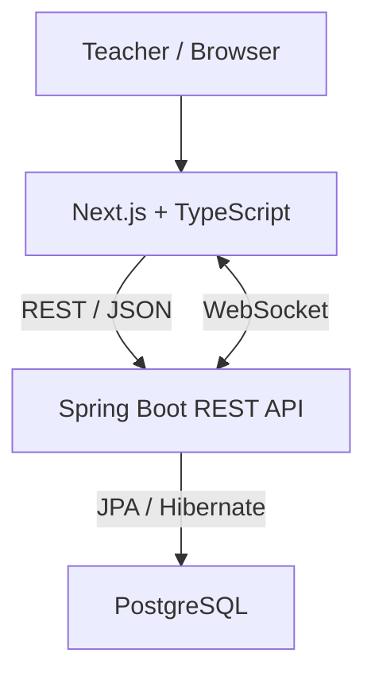

# Arena Dev

**Arena Dev** is a gamified classroom platform designed to increase student participation through challenges, XP, rankings, smart student draws, group generation and interactive learning sessions.

The project started as a simple Java desktop application for student management and is now being reengineered into a modern full-stack platform using **Java, Spring Boot, Next.js, PostgreSQL and Docker**.

> **Status:** Arena Dev v1 under active development. The current quality gate is Increment 11.3 — automated tests.

> **Current persistence:** the operational domains migrated through Increment 10 use Spring Boot + PostgreSQL as their source of truth. `localStorage` is not authoritative for domain data; it stores the selected-classroom preference and, on `/join`, the participant's temporary access needed for reconnection.

> **Project documentation:** see [`docs/STATUS_ATUAL.md`](docs/STATUS_ATUAL.md) for the current evidence-backed state and [`docs/adr/README.md`](docs/adr/README.md) for accepted product, UX and architecture decisions.

---

## Overview

Arena Dev is designed for classroom environments where students frequently participate in questions, programming challenges, debugging activities and practical assignments.

Instead of managing participation manually, the platform provides a centralized environment for:

* student and classroom management;
* attendance control;
* intelligent student draws;
* XP and scoring;
* rankings;
* classroom challenges;
* individual and group activities;
* participation history;
* gamified learning sessions.

The goal is not to turn learning into a competition, but to use gamification as a mechanism to improve **engagement, participation, consistency and visibility of student progress**.

---

## Core concepts

The game is based on a simple cycle:

```text
Teacher launches an activity
        ↓
Students participate
        ↓
Questions / challenges / deliveries
        ↓
XP events are registered
        ↓
Ranking and progression are updated
        ↓
Participation history is preserved
```

XP is designed around **events**, rather than storing only a final score.

For example:

```text
Maria
├── +10 XP → Correct answer
├── +15 XP → Debug challenge
├── +10 XP → Assignment delivered
└── +5 XP  → Collaboration
```

This makes the scoring system auditable and allows future analytics by student, classroom, activity and period.

---

## Game mechanics

Arena Dev implements several classroom mechanics and keeps later additions explicitly separated.

### Smart Draw

Students can be selected dynamically during classroom activities.

The draw algorithm will consider factors such as:

* attendance;
* previous selections;
* participation frequency;
* time since last participation.

The objective is to preserve randomness while reducing excessive repetition.

### XP and progression

Students accumulate XP through classroom participation and activities.

Examples:

| Event                 |  XP |
| --------------------- | --: |
| Correct answer        | +10 |
| Partial answer        |  +5 |
| Explain reasoning     |  +5 |
| Debug challenge       | +15 |
| Programming challenge | +20 |
| Assignment delivered  | +10 |
| Delivered on time     |  +5 |
| Collaboration         |  +5 |

Scoring rules will be configurable as the platform evolves.

### Ranking

The platform will provide multiple perspectives instead of relying exclusively on a global leaderboard:

* overall ranking;
* weekly progression;
* individual evolution;
* participation statistics.

### Game Sessions

Each class can create a game session containing:

* students present;
* draws;
* challenges;
* score events;
* classroom activity history.

### Individual, pairs and groups

Arena Dev supports changing the classroom organization during the same session:

* individual;
* pairs;
* trios;
* groups;
* programming teams or other collaborative arrangements.

The group generator considers previous combinations to reduce repeated pairings when possible. Returning to **Individual** does not create artificial one-person group history.

### Activities and question packages

Activities can contain their own question set and may also reference an external resource. Questions can be created manually, imported using the versioned Arena Dev JSON format or generated through a provider-agnostic prompt builder.

Supported question families currently include multiple choice, open response, true/false, bug fixing, analysis, practical tasks and scenario-based problems. Direct AI API integration is intentionally deferred; the current flow generates a structured prompt that can be copied to the teacher's preferred AI and imported back as validated JSON.

See `docs/ACTIVITY_QUESTIONS.md`, `docs/INCREMENT_10.md`, `docs/adr/README.md` and `docs/question-package-v1.schema.json`.

Activities are scoped to the selected classroom. They can be copied into another classroom as independent content and can optionally feed questions into an Arena session without removing the Arena's free/oral mode.

### Boss Battle and Buzzer

Boss Battle state is persisted per class session. The Buzzer supports temporary session codes, QR entry, participant identification and server-authoritative ordering over WebSocket.

### Future mechanics

Planned mechanics include:

* badges;
* achievements;
* streaks;
* combos;
* power-ups;
* timers;
* classroom team battles;
* richer mobile responses beyond Buzzer.

---

## Architecture

Arena Dev follows a separated frontend/backend architecture.



### Runtime architecture

```text
┌──────────────────────────────┐
│           Frontend           │
│     Next.js + TypeScript     │
│            :3000             │
└──────────────┬───────────────┘
               │
               │ REST
               ▼
┌──────────────────────────────┐
│            Backend           │
│    Java 21 + Spring Boot     │
│            :8080             │
└──────────────┬───────────────┘
               │
               │ JPA / JDBC
               ▼
┌──────────────────────────────┐
│         PostgreSQL           │
│            :5432             │
└──────────────────────────────┘
```

All services are orchestrated using **Docker Compose**.

---

## Tech stack

### Frontend

* Next.js
* React
* TypeScript

### Backend

* Java 21
* Spring Boot
* Spring Web
* Spring Data JPA
* Hibernate
* Jakarta Validation

### Database

* PostgreSQL

### Infrastructure

* Docker
* Docker Compose

### Implemented platform components

* Flyway migrations;
* Spring Security with HTTP session authentication for the teacher area;
* Spring WebSocket for session participation and Buzzer state;
* QR-based temporary participant access.

### Planned platform additions

* automated backend, concurrency and frontend tests;
* CI and release hardening;
* dedicated projector/public view;
* PWA support;
* Microsoft Graph / Microsoft Teams integration;
* persistent account model if the product requires it. JWT is not used by the current MVP.

---

## Project structure

```text
arena-dev/
│
├── backend/
│   ├── src/
│   │   └── main/
│   │       ├── java/
│   │       └── resources/
│   ├── Dockerfile
│   ├── .dockerignore
│   └── pom.xml
│
├── frontend/
│   ├── app/
│   ├── components/
│   ├── lib/
│   ├── Dockerfile
│   ├── .dockerignore
│   ├── package.json
│   └── tsconfig.json
│
├── compose.yaml
├── .env.example
├── .gitignore
└── README.md
```

As the backend evolves, its application structure will follow responsibilities such as:

```text
backend/
└── src/main/java/
    └── ...
        ├── controller/
        ├── service/
        ├── repository/
        ├── domain/
        ├── dto/
        ├── exception/
        └── config/
```

Game rules should remain isolated from HTTP and persistence concerns whenever possible.

---

## Current development status

Arena Dev v1 has completed the domain migration covered by Increments 1–10. `Classroom`, `Student`, `Enrollment`, `ClassSession`, `SessionParticipant`, `ScoreEvent`, activities, questions, external-result imports, session mechanics, join codes and Buzzer rounds are persisted through REST/PostgreSQL.

The current runtime path for the migrated domain is:

```text
Next.js
    ↓
REST API
    ↓
Spring Boot
    ↓
PostgreSQL
```

The current stabilization stage covers the teacher security boundary and realtime hardening implemented in Increments 11.1 and 11.2. The next quality gate is Increment 11.3: unit, integration, Testcontainers and Buzzer-concurrency tests. See [`docs/STATUS_ATUAL.md`](docs/STATUS_ATUAL.md) for implementation limits and validation evidence.

---

## Current domain model

The implemented core is organized around:

```text
Classroom
├── Enrollment ── Student
├── Activity
│   └── ActivityQuestion
└── ClassSession
    ├── SessionParticipant
    ├── SessionDynamic
    ├── ScoreEvent
    ├── SessionJoinCode
    └── BuzzerRound
        └── BuzzerPress
```

One of the main architectural decisions is that XP should be derived from **Score Events** rather than maintained only as a mutable total.

Conceptually:

```text
Student XP = SUM(ScoreEvent.points)
```

This enables:

* auditability;
* score corrections;
* historical reports;
* statistics by activity;
* statistics by class;
* individual progression analysis.

---

## Running locally

### Requirements

The easiest way to run Arena Dev is through Docker.

You need:

* Docker
* Docker Compose

For development outside containers, the project also uses:

* Java 21
* Maven
* Node.js
* npm

---

### Clone the repository

```bash
git clone https://github.com/wesscosta/arena-dev.git
cd arena-dev
```

---

### Configure environment variables

Create your local environment file:

```bash
cp .env.example .env
```

Example:

```dotenv
POSTGRES_DB=arena_dev
POSTGRES_USER=arena
POSTGRES_PASSWORD=change_me
```

Never commit the real `.env` file.

---

### Start the application

```bash
docker compose up --build
```

The first execution may take longer because Docker needs to download and build the application images.

---

## Application endpoints

### Frontend

```text
http://localhost:3000
```

### Backend

```text
http://localhost:8080
```

### Backend health check

```text
http://localhost:8080/api/health
```

You can also test it from the terminal:

```bash
curl http://localhost:8080/api/health
```

---

## Automated tests

The backend separates fast unit tests from PostgreSQL integration tests:

```bash
cd backend

# JUnit tests that do not require Docker
mvn test

# Full backend gate, including PostgreSQL 17 via Testcontainers
mvn verify
```

The integration gate starts the application on a random port, applies every Flyway migration and exercises the real HTTP security boundary. It requires Java 21, Maven and a Docker-compatible runtime.

---

## Docker commands

### Check running services

```bash
docker compose ps
```

### Follow all logs

```bash
docker compose logs -f
```

### Backend logs

```bash
docker compose logs -f backend
```

### Frontend logs

```bash
docker compose logs -f frontend
```

### PostgreSQL logs

```bash
docker compose logs -f postgres
```

### Stop the application

```bash
docker compose down
```

This keeps the PostgreSQL volume.

### Stop and remove database data

```bash
docker compose down -v
```

> Warning: this command deletes the PostgreSQL Docker volume used by the project.

---

## Development roadmap

### Foundation

* [x] Define Arena Dev concept
* [x] Create Next.js frontend
* [x] Create Java 21 backend
* [x] Configure Spring Boot
* [x] Configure PostgreSQL
* [x] Containerize the application
* [x] Configure Docker Compose
* [x] Add backend health check

### Core domain

* [x] Classroom management — REST/PostgreSQL
* [x] Student management — REST/PostgreSQL
* [x] Student enrollment — REST/PostgreSQL
* [x] Class sessions — REST/PostgreSQL
* [x] Session presence — REST/PostgreSQL
* [x] Score events — REST/PostgreSQL
* [x] XP calculation — projection from ScoreEvents
* [x] Ranking — projection from ScoreEvents

### Game engine

* [x] Server-authoritative smart student draw
* [x] ScoreEvent participation history
* [x] Individual / pair / trio / group organization
* [x] Previous-pairing-aware group generation in the backend
* [x] Activity question packages + JSON import
* [x] Provider-agnostic AI prompt builder
* [x] Persisted activities and questions
* [x] Persisted Boss Battle state
* [x] Activity → Arena flow
* [x] External-result CSV/TSV import
* [x] Server-authoritative Buzzer
* [ ] Challenges
* [ ] Debug battles
* [ ] Timers
* [ ] Combos

### Gamification

* [x] XP-derived levels and progress display
* [ ] Achievements
* [ ] Badges
* [ ] Streaks
* [ ] Power-ups

### Platform evolution

* [x] Teacher authentication for the MVP administrative area
* [x] Temporary student access by session code/QR
* [x] Real-time Buzzer participation
* [ ] Persistent teacher/student account model
* [ ] Dedicated projector/public view
* [ ] Automated test gate — Increments 11.3A and 11.3B validated; realtime concurrency and frontend pending
* [ ] CI and release hardening
* [ ] PWA support
* [ ] Microsoft Teams integration
* [ ] Analytics dashboard

---

## Project evolution

Arena Dev is also the result of the technical evolution of an older Java project.

### v0.1 — Java ControleAlunos

The original project was developed during the early stages of learning Java.

```text
Java 8
Swing
Ant
JDBC
MySQL
```

Its main purpose was basic student management.

### v0.2 — Legacy Stabilized

The legacy application was later modernized while intentionally preserving its desktop architecture.

```text
Java 21
Swing
Maven
JDBC
MySQL
Docker
```

This version introduced improvements such as:

* complete CRUD;
* improved persistence;
* validation;
* Maven build;
* database containerization;
* import/export improvements;
* better resource management.

### Arena Dev v1

The project is now being completely reengineered as a web platform.

```text
Java 21
Spring Boot
REST API
PostgreSQL
Next.js
TypeScript
Docker
```

The objective is not to simply rewrite the old application with newer technologies.

Arena Dev expands the original student-management domain into a platform focused on **classroom interaction and gamified learning**.

```text
Java ControleAlunos
        │
        │ modernization
        ▼
Legacy Stabilized
        │
        │ reengineering
        ▼
Arena Dev
```

The original versions remain available through the repository history, branches and Git tags.

---

## Version history

Historical versions include:

```text
v0.1-legacy
v0.2.0
```

The Arena Dev `v1.0.0` release will only be tagged after the core game functionality is considered stable.

---

## Design principles

Arena Dev follows a few important principles.

### Learning first

Gamification should support learning rather than replace it.

The intended balance is:

```text
Learning
    +
Participation
    +
Gamification
```

Game mechanics are tools for increasing attention, participation and consistency.

### Traceable scoring

Every score change should have a reason and history.

### Fair participation

Smart draws should reduce the probability that the same students dominate classroom participation.

### Minimal student data

Arena Dev should collect only the data required by its classroom use cases.

### Progressive architecture

Features should be added when the problem justifies them.

The project intentionally avoids introducing distributed systems, microservices or other infrastructure without a concrete need.

---

## Contributing

Arena Dev is currently under active development.

Issues, suggestions and discussions about:

* gamification mechanics;
* classroom workflows;
* backend architecture;
* frontend UX;
* educational use cases;

are welcome.

Before submitting large changes, open an issue describing the proposed improvement and its motivation.

---

## Repository

GitHub:

```text
https://github.com/wesscosta/arena-dev
```

---

## Author

Developed by **Weslley Costa**.

---

## License

A license will be defined before the first stable public release.

---

## Migration increment 1 — persistent foundation

At Increment 1, the frontend intentionally remained local-first while the persistent foundation was validated. Later increments completed the migration of the operational domains listed in [`docs/STATUS_ATUAL.md`](docs/STATUS_ATUAL.md).

Implemented in the backend:

- Flyway versioned migrations;
- Classroom;
- Student (optional registration during migration);
- Enrollment;
- ClassSession;
- SessionParticipant / attendance;
- REST endpoints for those domains;
- Hibernate schema validation instead of automatic schema mutation.

## Migration increment 2 — activities and classroom organization

Implemented without redesigning the baseline UI:

- Individual, pairs, trios and groups inside the same session;
- individual mode excluded from pairing history;
- Activity-owned questions;
- manual question creation;
- Arena Dev Question Package JSON v1;
- JSON validation/import by paste or file;
- AI prompt builder with compact inputs and presets;
- optional external activity platform + URL;
- existing XP/delivery workflow preserved.

See:

- `docs/BASELINE_AUDIT.md`
- `docs/MIGRATION_PLAN.md`
- `docs/API_INCREMENT_1.md`
- `docs/ACTIVITY_QUESTIONS.md`
- `docs/question-package-v1.schema.json`

## Migration increment 5 — sessions and presence

`ClassSession` and `SessionParticipant` are now loaded and mutated through the Spring Boot API. Reloading the browser restores the active session and attendance from PostgreSQL. One active session is allowed per classroom.

The temporary `SessionRuntimeState` introduced in Increment 5 has now been retired. Current mechanics are persisted as `SessionDynamic` state associated with the persistent session UUID; draw and group decisions are authoritative on the backend.

See `docs/INCREMENT_5.md` and ADR-0019.

## Migration increment 6 — ScoreEvent and ranking

`ScoreEvent` is now persisted through Spring Boot/PostgreSQL and is the only source of truth for XP. The ranking remains a projection of the event stream instead of a separately persisted counter. Arena scoring and activity deliveries use the API, including transactional batch creation.

History corrections no longer delete events: the backend creates an inverse `ADJUSTMENT` event with `reversalOf`, preserving the original launch for auditability. ScoreEvents are no longer written to `localStorage`, and local backup restore does not overwrite PostgreSQL scoring.

See `docs/INCREMENT_6.md` and ADR-0007.


## Migration increment 7 — activities and persistent mechanics

`Activity` and `ActivityQuestion` are now persisted through Spring Boot/PostgreSQL. Activity copy between classrooms is performed server-side and receives independent UUIDs. The JSON Question Package v1 and external-AI Prompt Builder remain unchanged as interchange mechanisms.

`QUICK_DRAW`, `GROUPS`, `BOSS_BATTLE` and `ARENA` now persist their current state through `SessionDynamic`. Smart draw and balanced group formation are decided by the backend; group pairing history is persisted separately. The browser no longer stores operational domain state in `localStorage`, only the selected classroom preference.

See `docs/INCREMENT_7.md` and ADR-0020.


## Increment 8 — External activity results

External activities can import CSV/TSV results through a preview-first workflow. The importer recognizes common exports from Wayground/Quizizz, Microsoft Forms, Google Forms and Kahoot plus a generic CSV shape. Student matching is validated against active classroom enrollments, unresolved rows require manual mapping, XP is calculated proportionally to the Activity XP, and every confirmed import is audited in PostgreSQL before creating ScoreEvents. Duplicate report content is blocked per Activity by fingerprint.

## Increments 9–11 — UX, realtime and stabilization

Increments 9.1 and 9.2 established the current `system overview → classroom workspace → live Arena` navigation. Increment 10 added session code/QR, `/join`, WebSocket participation and the server-authoritative Buzzer. Increments 11.1 and 11.2 added the teacher security boundary and realtime hardening.

The remaining stabilization work starts with automated tests in Increment 11.3 and continues with E2E, CI and release hardening in Increment 11.4. Current evidence and known limitations are maintained in [`docs/STATUS_ATUAL.md`](docs/STATUS_ATUAL.md).
