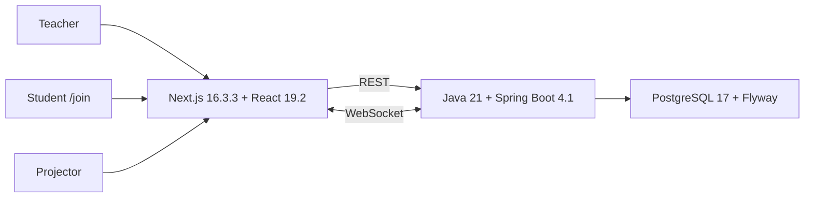

# Arena Dev Community

**Arena Dev Community** is an open-source, self-hosted platform for running and gamifying live classroom dynamics with low friction for the teacher.

> **Stable release:** `v0.4.0 — Live Classroom`, published from merge commit `ccfb7f9`.
>
> **Current development line:** `v0.5.0 — Live Quiz & Structured Responses`, branch `feat/v0.5-live-quiz`.
>
> **Current checkpoint:** `13.7A–13.7E` UX consolidation complete locally. Quiz runtime, structured `/join`, scoring, PWA, classroom identity, safe lifecycle management, dedicated classroom settings and Dark/Light/System themes are implemented. Local release gate is green; remote CI, backup/restore, rollback rehearsal and final gate are still required before `v0.5.0`.

## Product model

```text
Overview = system level
Classroom = pedagogical context
Arena = live classroom operation
```

Arena Dev centralizes attendance, activities, smart draws, XP, rankings, groups, realtime participation and public projection without becoming a full LMS.

## Main capabilities

- Classroom, students, enrollment and attendance.
- Activities and questions.
- Smart student draw.
- XP through auditable `ScoreEvent`.
- Operational classroom timeline through `SessionEvent`.
- Ranking derived from score events.
- Individual/pairs/trios/groups.
- Boss Battle.
- Buzzer.
- Synchronized Timer.
- Word Cloud.
- Public Projector.
- Student `/join` with structured Quiz responses.
- Live Quiz runtime with `MULTIPLE_CHOICE` and `TRUE_FALSE`.
- Dark / Light / System interface themes.
- Per-classroom color and semantic icon identity.
- Dedicated classroom management page with archive and safe hard delete.
- Structured Live Quiz with `MULTIPLE_CHOICE` and `TRUE_FALSE` responses.
- Mobile/PWA shell with explicit reconnect and offline-safe boundaries.
- Classroom visual identity with curated color/icon tokens.
- Dedicated classroom-management page for identity, appearance, lifecycle and destructive actions.
- Interface theme preference: Dark, Light or System.
- Ordered live-flow authoring through `ActivityStep`.
- Authoritative `LiveStageState` with audience-specific Projector and `/join` projections.

### Live flow

```text
Activity
└── ActivityStep[]
    ├── SLIDE
    ├── QUESTION
    ├── WORD_CLOUD
    └── POLL
```

`ActivityStep` is authoring data. Runtime interactions belong to the live session. The teacher controls progression manually and the backend is authoritative for the current step.

## Architecture



Principles:

- modular monolith;
- REST for durable state and administrative commands;
- WebSocket only for immediate synchronization;
- backend-authoritative session mechanics;
- `localStorage` is not a domain source of truth;
- no Redis, Kafka, Kubernetes or microservices without demonstrated need.

## Stable v0.4 baseline

Completed:

- **12.1** Timer;
- **12.2** Projector;
- **12.3** Word Cloud;
- **12.4A/B/C foundation** ActivityStep, editor and authoritative current-step runtime;
- **12.3D.6** contextual navigation without redundant sidebar;
- **12.3D.7A** Design System foundation;
- **12.3D.7B** Core UI Primitives;
- **12.3D.7C** Accessibility Pass;
- **12.3D.7D** Responsive & Visual Polish.

Current foundation and runtime:

- **12.4D.0A** authoritative Live Stage / presentation state;
- **12.4D.0B** adapters: Draw, Word Cloud, Buzzer and Poll under `Dinâmicas`;
- **12.4D.0C** `Enrollment.preferredName` + backend-resolved `displayName`;
- **12.4D.0D** opaque device recognition separated from the temporary participant token;
- **12.4D.1** Poll/Voting runtime with anonymous aggregate public projection;
- **12.4E** Live Flow ↔ Live Stage orchestration with prepared Slide/Question projection, runtime reuse for Word Cloud/Poll and Boss stage adapter;
- **12.4F** public `/join` + Projector consolidation and reconnect hardening;
- **12.5** chronological `SessionEvent` / operational timeline, separated from reversible `ScoreEvent` history.

Release closure:

- **12.6** hardening, E2E, security/observability and `v0.4.0` release gate — completed;
- PR #9 merged into `main`;
- CI run `34428450704` completed successfully;
- annotated tag `v0.4.0` points to merge commit `ccfb7f9`;
- GitHub Release `Arena Dev Community v0.4.0` published.

## Current v0.5 direction

`v0.5.0` closes the remaining structured-response gap without turning Arena Dev into a generic quiz platform:

```text
ActivityQuestion (authoring)
        ↓
QuizRound (live runtime)
        ↓
ParticipantAnswer (answer truth)
        ↓
evaluation
        ↓
ScoreEvent (XP truth)
```

The first supported response types are `MULTIPLE_CHOICE` and `TRUE_FALSE`.
Open/practical answers, advanced analytics, badges/streaks and AI correction are intentionally outside the initial Quiz Runtime.

## Live Stage

```text
Teacher ──controls──► LiveStageState
                        ├── primary
                        ├── audience
                        └── timer overlay
                         ↙          ↘
                  /projector       /join
```

Projector and participant UI are different projections of the same authoritative session state. Public clients receive only the data needed for their audience; for example, a projected draw receives `displayName` rather than the student UUID. Specialized events such as `WORD_CLOUD_STATE`, `BUZZER_STATE` and `TIMER_STATE` still own detailed module runtime.

See [`docs/INCREMENT_12_4D_0.md`](docs/INCREMENT_12_4D_0.md), [`docs/INCREMENT_12_4D_1.md`](docs/INCREMENT_12_4D_1.md), [`docs/INCREMENT_12_4E.md`](docs/INCREMENT_12_4E.md), [`docs/INCREMENT_12_4F.md`](docs/INCREMENT_12_4F.md), ADR-0027, ADR-0028, ADR-0029 and ADR-0030.

## Operational timeline

`SessionEvent` records high-level classroom facts without replacing their authoritative domains:

```text
ScoreEvent        → XP truth
Poll/WordCloud    → response truth
Buzzer/Timer/Boss → runtime truth
SessionEvent      → chronological operational projection
```

The History view separates `Linha do tempo` from `Histórico de XP`. Individual votes, words, Buzzer presses, reconnects and timer ticks are deliberately excluded from the operational timeline. See [`docs/INCREMENT_12_5.md`](docs/INCREMENT_12_5.md) and ADR-0031.

## Poll semantics

```text
POLL       = opinion / diagnostic / collective single-choice
QUESTION   = evaluated question / correctness / XP
WORD_CLOUD = free-text collective response
```

Poll public results are aggregated and anonymous. Identity is used only for uniqueness/audit rules.

## Design System and accessibility

New UI must reuse the existing primitives:

```text
Button
IconButton
Badge
Tabs
Menu
Breadcrumb
Field
Card
EmptyState
LiveRegion
```

Style layers:

```text
frontend/styles/
├── tokens.css
├── base.css
├── accessibility.css
└── arena-polish.css
```

Requirements include keyboard operation, visible focus, semantic hierarchy, contrast, reduced motion, zoom/reflow and controlled `aria-live`.

See [`docs/DESIGN_SYSTEM.md`](docs/DESIGN_SYSTEM.md) and [`docs/ACCESSIBILITY.md`](docs/ACCESSIBILITY.md).

## Running locally

```bash
git clone https://github.com/wesscosta/arena-dev.git
cd arena-dev
cp .env.example .env
docker compose up -d --build
docker compose ps
```

Frontend: `http://localhost:3000`

Backend: `http://localhost:8080`

Health readiness: `http://localhost:8080/api/health/ready`

Health liveness: `http://localhost:8080/api/health/live`

## Development gates

Frontend:

```bash
cd frontend
npm test
npm run typecheck
npm run build
```

Backend changes:

```bash
cd backend
mvn -B -ntp verify
```

Compose:

```bash
docker compose up -d --build
sleep 5
docker compose ps
```

## Stable release v0.3.0

- commit: `6015d6d416edc26bfb8295c2aa6af141b9d6b9ad`;
- final recorded CI: `33964844054`;
- release: <https://github.com/wesscosta/arena-dev/releases/tag/v0.3.0>;
- MIT licensed.

`v0.1-legacy`, `v0.2.0` and `v0.2.1` belong to the old desktop application and are not web rollback targets.

The `v0.3.0` tag is frozen and must not be moved or recreated.

## v0.5.0 release candidate metadata

Maven, npm and release tooling are aligned on `0.5.0`.

The current candidate is functionally closed locally through **13.7E**:

- Quiz Runtime and structured participant responses;
- results/reveal on `/join` and Projector;
- evaluation through `ScoreEvent`;
- pedagogical feedback;
- Mobile/PWA;
- Students UX and classroom visual identity (`V17`);
- safe explicit hard delete;
- distinct Start/Resume Arena CTAs;
- dedicated classroom-management page;
- Dark/Light/System theme preference.

The complete **local release gate is green**. This does **not** mean `v0.5.0` is published.

Before the tag can be created, the exact final SHA must still pass:

```text
commit/push
PR + merge
CI green on final SHA
real PostgreSQL backup + SHA-256
restore-check PostgreSQL 17 / Flyway V1–V17
rollback/restore rehearsal
scripts/release/release-gate.sh final
```

The annotated `v0.5.0` tag is created only after those evidences are recorded.

## Documentation

Current:

- [`docs/STATUS_ATUAL.md`](docs/STATUS_ATUAL.md)
- [`docs/ROADMAP_0_5.md`](docs/ROADMAP_0_5.md)
- [`docs/RELEASE_0_5_0.md`](docs/RELEASE_0_5_0.md)
- [`docs/INCREMENT_13_7.md`](docs/INCREMENT_13_7.md)
- [`docs/INCREMENT_13_7A.md`](docs/INCREMENT_13_7A.md)
- [`docs/INCREMENT_13_7B.md`](docs/INCREMENT_13_7B.md)
- [`docs/INCREMENT_13_7C.md`](docs/INCREMENT_13_7C.md)
- [`docs/INCREMENT_13_7D.md`](docs/INCREMENT_13_7D.md)
- [`docs/INCREMENT_13_7E.md`](docs/INCREMENT_13_7E.md)
- [`docs/DOCUMENTATION_INDEX.md`](docs/DOCUMENTATION_INDEX.md)
- [`docs/DESIGN_SYSTEM.md`](docs/DESIGN_SYSTEM.md)
- [`docs/ACCESSIBILITY.md`](docs/ACCESSIBILITY.md)
- [`docs/adr/README.md`](docs/adr/README.md)

Historical `INCREMENT_*.md` documents remain versioned as implementation history.

## License

MIT.
