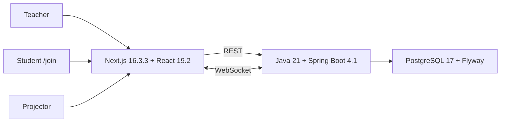

# Arena Dev Community

**Arena Dev Community** is an open-source, self-hosted platform for running and gamifying live classroom dynamics with low friction for the teacher.

> **Stable release:** `v0.3.0`, published on **September 5, 2026**.
>
> **Current development line:** `v0.4 — Live Classroom`, branch `feat/v0.4-live-classroom`.
>
> **Current checkpoint:** Timer, Projector, Word Cloud, ActivityStep/live-flow runtime, contextual navigation, Design System, accessibility and responsive Arena polish are consolidated. `12.4D — Live Stage, identity and Poll`, `12.4E — Live Flow ↔ Live Stage orchestration` and `12.4F — public /join + Projector consolidation` are implemented locally. Public reconnect now restores one audience-specific runtime snapshot, Buzzer public projection no longer exposes administrative identity, and Boss HP is synchronized end to end. **Next: 12.5 SessionEvent / operational timeline, followed by 12.6 hardening and the v0.4.0 gate.**

## Product model

```text
Overview = system level
Classroom = pedagogical context
Arena = live classroom operation
```

Arena Dev centralizes attendance, activities, smart draws, XP, rankings, groups, realtime participation and public projection without becoming a full LMS.

## Main capabilities

- Classroom, students, enrollment and attendance.
- Activities and questions.
- Smart student draw.
- XP through auditable `ScoreEvent`.
- Ranking derived from score events.
- Individual/pairs/trios/groups.
- Boss Battle.
- Buzzer.
- Synchronized Timer.
- Word Cloud.
- Public Projector.
- Student `/join`.
- Ordered live-flow authoring through `ActivityStep`.
- Authoritative `LiveStageState` with audience-specific Projector and `/join` projections.

### Live flow

```text
Activity
└── ActivityStep[]
    ├── SLIDE
    ├── QUESTION
    ├── WORD_CLOUD
    └── POLL
```

`ActivityStep` is authoring data. Runtime interactions belong to the live session. The teacher controls progression manually and the backend is authoritative for the current step.

## Architecture



Principles:

- modular monolith;
- REST for durable state and administrative commands;
- WebSocket only for immediate synchronization;
- backend-authoritative session mechanics;
- `localStorage` is not a domain source of truth;
- no Redis, Kafka, Kubernetes or microservices without demonstrated need.

## Current v0.4 status

Completed:

- **12.1** Timer;
- **12.2** Projector;
- **12.3** Word Cloud;
- **12.4A/B/C foundation** ActivityStep, editor and authoritative current-step runtime;
- **12.3D.6** contextual navigation without redundant sidebar;
- **12.3D.7A** Design System foundation;
- **12.3D.7B** Core UI Primitives;
- **12.3D.7C** Accessibility Pass;
- **12.3D.7D** Responsive & Visual Polish.

Current foundation and runtime:

- **12.4D.0A** authoritative Live Stage / presentation state;
- **12.4D.0B** adapters: Draw, Word Cloud, Buzzer and Poll under `Dinâmicas`;
- **12.4D.0C** `Enrollment.preferredName` + backend-resolved `displayName`;
- **12.4D.0D** opaque device recognition separated from the temporary participant token;
- **12.4D.1** Poll/Voting runtime with anonymous aggregate public projection;
- **12.4E** Live Flow ↔ Live Stage orchestration with prepared Slide/Question projection, runtime reuse for Word Cloud/Poll and Boss stage adapter.

Next:

- **12.4F** public `/join` + Projector consolidation and reconnect hardening;
- **12.5** chronological `SessionEvent` / operational timeline;
- **12.6** hardening and `v0.4.0` gate.

## Live Stage

```text
Teacher ──controls──► LiveStageState
                        ├── primary
                        ├── audience
                        └── timer overlay
                         ↙          ↘
                  /projector       /join
```

Projector and participant UI are different projections of the same authoritative session state. Public clients receive only the data needed for their audience; for example, a projected draw receives `displayName` rather than the student UUID. Specialized events such as `WORD_CLOUD_STATE`, `BUZZER_STATE` and `TIMER_STATE` still own detailed module runtime.

See [`docs/INCREMENT_12_4D_0.md`](docs/INCREMENT_12_4D_0.md), [`docs/INCREMENT_12_4D_1.md`](docs/INCREMENT_12_4D_1.md), [`docs/INCREMENT_12_4E.md`](docs/INCREMENT_12_4E.md), [`docs/INCREMENT_12_4F.md`](docs/INCREMENT_12_4F.md), ADR-0027, ADR-0028, ADR-0029 and ADR-0030.

## Poll semantics

```text
POLL       = opinion / diagnostic / collective single-choice
QUESTION   = evaluated question / correctness / XP
WORD_CLOUD = free-text collective response
```

Poll public results are aggregated and anonymous. Identity is used only for uniqueness/audit rules.

## Design System and accessibility

New UI must reuse the existing primitives:

```text
Button
IconButton
Badge
Tabs
Menu
Breadcrumb
Field
Card
EmptyState
LiveRegion
```

Style layers:

```text
frontend/styles/
├── tokens.css
├── base.css
├── accessibility.css
└── arena-polish.css
```

Requirements include keyboard operation, visible focus, semantic hierarchy, contrast, reduced motion, zoom/reflow and controlled `aria-live`.

See [`docs/DESIGN_SYSTEM.md`](docs/DESIGN_SYSTEM.md) and [`docs/ACCESSIBILITY.md`](docs/ACCESSIBILITY.md).

## Running locally

```bash
git clone https://github.com/wesscosta/arena-dev.git
cd arena-dev
cp .env.example .env
docker compose up -d --build
docker compose ps
```

Frontend: `http://localhost:3000`

Backend: `http://localhost:8080`

Health: `http://localhost:8080/api/health`

## Development gates

Frontend:

```bash
cd frontend
npm test
npm run typecheck
npm run build
```

Backend changes:

```bash
cd backend
mvn -B -ntp verify
```

Compose:

```bash
docker compose up -d --build
sleep 5
docker compose ps
```

## Stable release v0.3.0

- commit: `6015d6d416edc26bfb8295c2aa6af141b9d6b9ad`;
- final recorded CI: `33964844054`;
- release: <https://github.com/wesscosta/arena-dev/releases/tag/v0.3.0>;
- MIT licensed.

`v0.1-legacy`, `v0.2.0` and `v0.2.1` belong to the old desktop application and are not web rollback targets.

The `v0.3.0` tag is frozen and must not be moved or recreated.

## Version metadata during v0.4 development

Maven/npm manifests intentionally remain on `0.3.0` while the release tooling still validates that version. Do not casually bump versions until the versioning strategy is explicitly updated.

## Documentation

Current:

- [`docs/STATUS_ATUAL.md`](docs/STATUS_ATUAL.md)
- [`docs/ROADMAP_0_4.md`](docs/ROADMAP_0_4.md)
- [`docs/INCREMENT_12_4D_0.md`](docs/INCREMENT_12_4D_0.md)
- [`docs/CHECKPOINT_PRE_12_4D.md`](docs/CHECKPOINT_PRE_12_4D.md) — historical checkpoint
- [`docs/DOCUMENTATION_INDEX.md`](docs/DOCUMENTATION_INDEX.md)
- [`docs/DESIGN_SYSTEM.md`](docs/DESIGN_SYSTEM.md)
- [`docs/ACCESSIBILITY.md`](docs/ACCESSIBILITY.md)
- [`docs/RELEASE_0_3_0.md`](docs/RELEASE_0_3_0.md)
- [`docs/adr/README.md`](docs/adr/README.md)

Historical `INCREMENT_*.md` documents remain versioned as implementation history.

## License

MIT.
