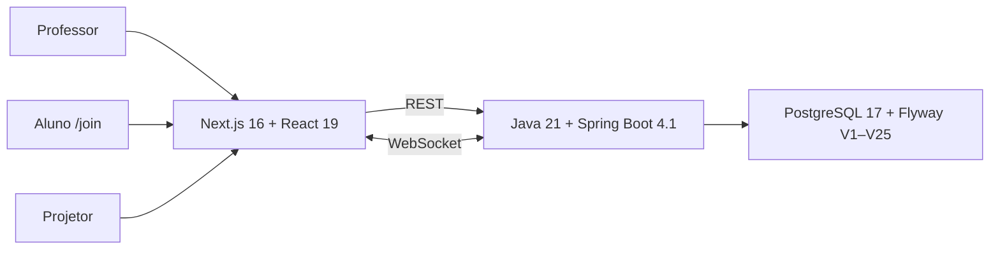

# Arena Dev Community

**Arena Dev Community** é uma plataforma open source e self-hosted para condução, participação e gamificação de dinâmicas de sala, com foco em baixa fricção para o professor.

> **Release estável:** `v0.5.0 — Live Quiz & Structured Responses`.
>
> **Linha em fechamento:** `v0.6.0 — Submissions, Assessment & Feedback`.
>
> **Branch:** `feat/v0.6-submissions-assessment`.
>
> **Estado:** implementação funcional concluída até o incremento `14.11`; a release `v0.6.0` ainda depende de commit final do polish, gate local, merge em `main`, CI no SHA final, backup/restore-check e gate final antes da tag.

## Modelo do produto

```text
Visão geral = nível do sistema
Turma       = contexto pedagógico
Arena       = operação da aula ao vivo
Entregas    = fluxo assíncrono de submissão, correção e feedback
```

Arena Dev não pretende ser um LMS completo. O produto concentra a condução da aula, participação dos estudantes, atividades, entregas, avaliação supervisionada e gamificação.

## Capacidades principais

### Turma e Arena
- turmas, estudantes, matrículas e presença;
- sessão de aula com estado autoritativo no backend;
- Sorteio, Nuvem de Palavras, Votação, Quiz, Buzzer e Boss Battle;
- Timer sincronizado;
- grupos, duplas e trios;
- Projetor público;
- entrada do aluno por `/join`;
- ranking e histórico;
- XP auditável por `ScoreEvent`;
- timeline operacional por `SessionEvent`.

### Atividades e entregas — v0.6
- `ActivitySubmission` como fonte de verdade da entrega;
- `SubmissionItem` polimórfico para `QUESTION_RESPONSE`, `TEXT`, `LINK`, `CODE` e referências de artefatos;
- autosave, restauração e envio;
- dashboard de entregas por atividade;
- correção individual com navegação entre estudantes;
- rubricas e critérios estruturados;
- avaliação manual separada de XP;
- correção assistida por IA sob supervisão;
- feedback individual com publicação explícita;
- preparação/triagem em lote sem autopublicação;
- evidências de processo e recomendação de revisão humana;
- fronteira provider-independent para Microsoft Teams e Google Classroom.

## Invariantes de domínio

```text
ActivityQuestion    = autoria da pergunta
QuizRound           = runtime do Quiz ao vivo
ParticipantAnswer   = verdade da resposta do Quiz
ActivitySubmission  = verdade da entrega da atividade
SubmissionItem      = conteúdo persistido da entrega
SubmissionAssessment= avaliação da entrega
ScoreEvent          = verdade do XP
LiveStage           = estado público/apresentado
SessionEvent        = timeline operacional
```

A nota da avaliação não substitui `ScoreEvent`. XP continua sendo derivado exclusivamente de eventos de pontuação.

## IA supervisionada

A IA pode sugerir análise, pontuação por critério e feedback, mas não é autoridade da avaliação.

```text
entrega
  ↓
sugestão da IA
  ↓
professor revisa/edita/descarta
  ↓
avaliação docente
  ↓
publicação explícita
  ↓
aluno recebe publishedFeedback
```

Rascunhos, notas privadas e sugestões da IA não são publicados automaticamente nem preparados para sincronização externa.

## Evidências de processo

A v0.6 registra sinais operacionais para apoiar revisão humana, como eventos de salvamento, colagem, envio, tempo e similaridade textual.

Esses sinais **não** constituem detector de IA, plágio ou fraude. O sistema produz apenas recomendação de revisão (`LOW`, `MEDIUM`, `HIGH`).

## Integrações externas

A arquitetura está preparada para integrações futuras sem contaminar o domínio central:

```text
Arena Dev
   ↓
ActivitySubmission / Assessment
   ↓
LearningPlatformGateway
   ├── Microsoft Teams
   └── Google Classroom
```

A v0.6 cria contratos e vínculos externos, mas não ativa adapters reais de sincronização.

## Arquitetura



Princípios:

- monólito modular;
- REST para estado durável e comandos;
- WebSocket para sincronização imediata;
- backend autoritativo para sessão, XP e runtimes;
- PostgreSQL/Flyway como fonte de verdade persistente;
- evitar Redis, Kafka, Kubernetes e microserviços sem necessidade demonstrada.

## Linha v0.6.0

```text
14.0  Bootstrap e arquitetura                         concluído
14.1  ActivitySubmission                              concluído
14.2  SubmissionItem + autosave + envio              concluído
14.3  Dashboard de entregas                           concluído
14.4  Correção individual                             concluído
14.4A Visibilidade/navegação de entregas              concluído
14.4B Fluxo visual do aluno                           concluído
14.5  Rubricas e avaliação estruturada                concluído
14.6  AI-assisted grading                             concluído
14.7  Feedback individual                             concluído
14.8  Correção em lote / triagem                      concluído
14.9  Evidências de processo e integridade            concluído
14.10 Preparação Teams/Classroom                      concluído
14.11 Hardening, E2E e release gate                   em fechamento
```

Schema atual da linha: **Flyway V1–V25**.

## UX polish do fechamento

O fechamento da v0.6 também consolidou a interface:

- remoção de microcopy redundante na sessão ao vivo;
- escala tipográfica mais consistente;
- navegação para Home da turma ao encerrar sessão;
- Timer com layout e presets refinados;
- badge `AO VIVO` junto ao título da sessão;
- cards de turmas com altura/footer uniformes;
- status de sessão no footer do card;
- CTA `Iniciar Arena` / `Continuar Arena` com largura total e linguagem visual unificada.

## Executando localmente

```bash
git clone https://github.com/wesscosta/arena-dev.git
cd arena-dev
cp .env.example .env
docker compose up -d --build
docker compose ps
```

Frontend: `http://localhost:3000`

Backend: `http://localhost:8080`

Readiness: `http://localhost:8080/api/health/ready`

Liveness: `http://localhost:8080/api/health/live`

## Gates de desenvolvimento

Backend:

```bash
cd backend
mvn -B -ntp verify
```

Frontend:

```bash
cd frontend
npm test
npm run typecheck
npm run build
```

Gate completo da release:

```bash
scripts/release/release-gate.sh local
```

Após merge em `main`, CI verde no mesmo SHA e backup real:

```bash
scripts/release/release-gate.sh final \
  --ci-run-url <URL_DO_RUN> \
  --backup <ARQUIVO.dump>
```

A tag `v0.6.0` só deve ser criada após o gate final verde.

## Documentação corrente

- [`docs/STATUS_ATUAL.md`](docs/STATUS_ATUAL.md)
- [`docs/ROADMAP_0_6.md`](docs/ROADMAP_0_6.md)
- [`docs/RELEASE_0_6.md`](docs/RELEASE_0_6.md)
- [`docs/INCREMENT_14_0.md`](docs/INCREMENT_14_0.md) até [`docs/INCREMENT_14_11.md`](docs/INCREMENT_14_11.md)
- [`docs/POLISH_14_11C_UI_FINAL.md`](docs/POLISH_14_11C_UI_FINAL.md)
- [`docs/DOCUMENTATION_INDEX.md`](docs/DOCUMENTATION_INDEX.md)
- [`docs/DESIGN_SYSTEM.md`](docs/DESIGN_SYSTEM.md)
- [`docs/ACCESSIBILITY.md`](docs/ACCESSIBILITY.md)
- [`docs/adr/README.md`](docs/adr/README.md)

Documentos das linhas v0.3, v0.4 e v0.5 permanecem versionados como histórico.

## Releases

- `v0.3.0` — histórica;
- `v0.4.0` — histórica;
- `v0.5.0` — estável publicada;
- `v0.6.0` — candidata em fechamento, ainda não tagueada.

## Licença

MIT.
