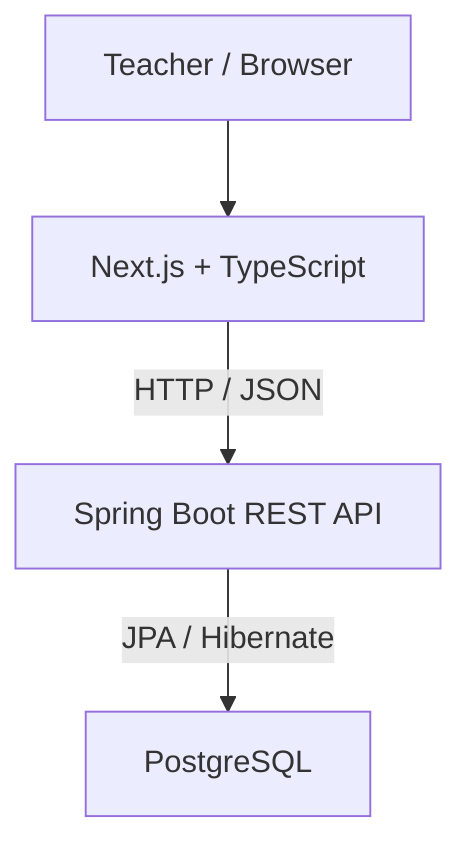

# Arena Dev

**Arena Dev** is a gamified classroom platform designed to increase student participation through challenges, XP, rankings, smart student draws, group generation and interactive learning sessions.

The project started as a simple Java desktop application for student management and is now being reengineered into a modern full-stack platform using **Java, Spring Boot, Next.js, PostgreSQL and Docker**.

> **Status:** under active development — Arena Dev v1.

> **Migration strategy:** the current Next.js interface is the product baseline and remains intentionally unchanged while persistence is migrated incrementally from `localStorage` to Spring Boot + PostgreSQL. The first persistent increment covers classrooms, students, enrollments, class sessions and attendance.

> **Architecture decisions:** accepted product, UX and technical decisions are versioned in [`docs/adr/README.md`](docs/adr/README.md).

---

## Overview

Arena Dev is designed for classroom environments where students frequently participate in questions, programming challenges, debugging activities and practical assignments.

Instead of managing participation manually, the platform provides a centralized environment for:

* student and classroom management;
* attendance control;
* intelligent student draws;
* XP and scoring;
* rankings;
* classroom challenges;
* individual and group activities;
* participation history;
* gamified learning sessions.

The goal is not to turn learning into a competition, but to use gamification as a mechanism to improve **engagement, participation, consistency and visibility of student progress**.

---

## Core concepts

The game is based on a simple cycle:

```text
Teacher launches an activity
        ↓
Students participate
        ↓
Questions / challenges / deliveries
        ↓
XP events are registered
        ↓
Ranking and progression are updated
        ↓
Participation history is preserved
```

XP is designed around **events**, rather than storing only a final score.

For example:

```text
Maria
├── +10 XP → Correct answer
├── +15 XP → Debug challenge
├── +10 XP → Assignment delivered
└── +5 XP  → Collaboration
```

This makes the scoring system auditable and allows future analytics by student, classroom, activity and period.

---

## Planned game mechanics

Arena Dev is being designed around several classroom mechanics.

### Smart Draw

Students can be selected dynamically during classroom activities.

The draw algorithm will consider factors such as:

* attendance;
* previous selections;
* participation frequency;
* time since last participation.

The objective is to preserve randomness while reducing excessive repetition.

### XP and progression

Students accumulate XP through classroom participation and activities.

Examples:

| Event                 |  XP |
| --------------------- | --: |
| Correct answer        | +10 |
| Partial answer        |  +5 |
| Explain reasoning     |  +5 |
| Debug challenge       | +15 |
| Programming challenge | +20 |
| Assignment delivered  | +10 |
| Delivered on time     |  +5 |
| Collaboration         |  +5 |

Scoring rules will be configurable as the platform evolves.

### Ranking

The platform will provide multiple perspectives instead of relying exclusively on a global leaderboard:

* overall ranking;
* weekly progression;
* individual evolution;
* participation statistics.

### Game Sessions

Each class can create a game session containing:

* students present;
* draws;
* challenges;
* score events;
* classroom activity history.

### Individual, pairs and groups

Arena Dev supports changing the classroom organization during the same session:

* individual;
* pairs;
* trios;
* groups;
* programming teams or other collaborative arrangements.

The group generator considers previous combinations to reduce repeated pairings when possible. Returning to **Individual** does not create artificial one-person group history.

### Activities and question packages

Activities can contain their own question set and may also reference an external resource. Questions can be created manually, imported using the versioned Arena Dev JSON format or generated through a provider-agnostic prompt builder.

Supported question families currently include multiple choice, open response, true/false, bug fixing, analysis, practical tasks and scenario-based problems. Direct AI API integration is intentionally deferred; the current flow generates a structured prompt that can be copied to the teacher's preferred AI and imported back as validated JSON.

See `docs/ACTIVITY_QUESTIONS.md` and `docs/question-package-v1.schema.json`.

### Future mechanics

Planned mechanics include:

* Boss Battles;
* badges;
* achievements;
* streaks;
* combos;
* power-ups;
* timers;
* classroom team battles;
* student mobile participation.

---

## Architecture

Arena Dev follows a separated frontend/backend architecture.



### Runtime architecture

```text
┌──────────────────────────────┐
│           Frontend           │
│     Next.js + TypeScript     │
│            :3000             │
└──────────────┬───────────────┘
               │
               │ REST
               ▼
┌──────────────────────────────┐
│            Backend           │
│    Java 21 + Spring Boot     │
│            :8080             │
└──────────────┬───────────────┘
               │
               │ JPA / JDBC
               ▼
┌──────────────────────────────┐
│         PostgreSQL           │
│            :5432             │
└──────────────────────────────┘
```

All services are orchestrated using **Docker Compose**.

---

## Tech stack

### Frontend

* Next.js
* React
* TypeScript

### Backend

* Java 21
* Spring Boot
* Spring Web
* Spring Data JPA
* Hibernate
* Jakarta Validation

### Database

* PostgreSQL

### Infrastructure

* Docker
* Docker Compose

### Planned additions

* Flyway (implemented)
* Spring Security
* JWT
* WebSocket / real-time sessions
* PWA
* Microsoft Graph / Microsoft Teams integration

---

## Project structure

```text
arena-dev/
│
├── backend/
│   ├── src/
│   │   └── main/
│   │       ├── java/
│   │       └── resources/
│   ├── Dockerfile
│   ├── .dockerignore
│   └── pom.xml
│
├── frontend/
│   ├── app/
│   ├── components/
│   ├── lib/
│   ├── Dockerfile
│   ├── .dockerignore
│   ├── package.json
│   └── tsconfig.json
│
├── compose.yaml
├── .env.example
├── .gitignore
└── README.md
```

As the backend evolves, its application structure will follow responsibilities such as:

```text
backend/
└── src/main/java/
    └── ...
        ├── controller/
        ├── service/
        ├── repository/
        ├── domain/
        ├── dto/
        ├── exception/
        └── config/
```

Game rules should remain isolated from HTTP and persistence concerns whenever possible.

---

## Current development status

Arena Dev v1 is currently transitioning from the first local prototype to the Java backend.

The frontend already contains the initial game experience and currently persists part of its state locally in the browser.

The backend currently provides the foundation for the permanent architecture:

```text
Next.js
    ↓
REST API
    ↓
Spring Boot
    ↓
PostgreSQL
```

The next development stage is migrating the core entities and game state from local browser storage to the Spring Boot API.

---

## Initial domain model

The core domain is expected to evolve around:

```text
Teacher
   │
   └── Classroom
          │
          ├── Enrollment ─── Student
          │
          └── GameSession
                │
                ├── Attendance
                ├── DrawEvent
                ├── Challenge
                └── ScoreEvent
                       │
                       └── Student
```

One of the main architectural decisions is that XP should be derived from **Score Events** rather than maintained only as a mutable total.

Conceptually:

```text
Student XP = SUM(ScoreEvent.points)
```

This enables:

* auditability;
* score corrections;
* historical reports;
* statistics by activity;
* statistics by class;
* individual progression analysis.

---

## Running locally

### Requirements

The easiest way to run Arena Dev is through Docker.

You need:

* Docker
* Docker Compose

For development outside containers, the project also uses:

* Java 21
* Maven
* Node.js
* npm

---

### Clone the repository

```bash
git clone https://github.com/wesscosta/arena-dev.git
cd arena-dev
```

---

### Configure environment variables

Create your local environment file:

```bash
cp .env.example .env
```

Example:

```dotenv
POSTGRES_DB=arena_dev
POSTGRES_USER=arena
POSTGRES_PASSWORD=change_me
```

Never commit the real `.env` file.

---

### Start the application

```bash
docker compose up --build
```

The first execution may take longer because Docker needs to download and build the application images.

---

## Application endpoints

### Frontend

```text
http://localhost:3000
```

### Backend

```text
http://localhost:8080
```

### Backend health check

```text
http://localhost:8080/api/health
```

You can also test it from the terminal:

```bash
curl http://localhost:8080/api/health
```

---

## Docker commands

### Check running services

```bash
docker compose ps
```

### Follow all logs

```bash
docker compose logs -f
```

### Backend logs

```bash
docker compose logs -f backend
```

### Frontend logs

```bash
docker compose logs -f frontend
```

### PostgreSQL logs

```bash
docker compose logs -f postgres
```

### Stop the application

```bash
docker compose down
```

This keeps the PostgreSQL volume.

### Stop and remove database data

```bash
docker compose down -v
```

> Warning: this command deletes the PostgreSQL Docker volume used by the project.

---

## Development roadmap

### Foundation

* [x] Define Arena Dev concept
* [x] Create Next.js frontend
* [x] Create Java 21 backend
* [x] Configure Spring Boot
* [x] Configure PostgreSQL
* [x] Containerize the application
* [x] Configure Docker Compose
* [x] Add backend health check

### Core domain

* [ ] Classroom management
* [ ] Student management
* [ ] Student enrollment
* [ ] Game sessions
* [ ] Attendance
* [ ] Score events
* [ ] XP calculation
* [ ] Ranking

### Game engine

* [x] Smart student draw — local-first baseline
* [x] Participation history — local-first baseline
* [x] Individual / pair / trio / group organization — local-first baseline
* [x] Previous-pairing-aware group generation — local-first baseline
* [x] Activity question packages + JSON import — local-first baseline
* [x] Provider-agnostic AI prompt builder — local-first baseline
* [ ] Persist activities/questions in backend
* [ ] Challenges
* [ ] Debug battles
* [ ] Timers
* [ ] Combos
* [ ] Boss Battles

### Gamification

* [ ] Levels
* [ ] Achievements
* [ ] Badges
* [ ] Streaks
* [ ] Power-ups

### Platform evolution

* [ ] Authentication
* [ ] Teacher accounts
* [ ] Student access
* [ ] QR Code session join
* [ ] Real-time classroom sessions
* [ ] PWA support
* [ ] Microsoft Teams integration
* [ ] Analytics dashboard

---

## Project evolution

Arena Dev is also the result of the technical evolution of an older Java project.

### v0.1 — Java ControleAlunos

The original project was developed during the early stages of learning Java.

```text
Java 8
Swing
Ant
JDBC
MySQL
```

Its main purpose was basic student management.

### v0.2 — Legacy Stabilized

The legacy application was later modernized while intentionally preserving its desktop architecture.

```text
Java 21
Swing
Maven
JDBC
MySQL
Docker
```

This version introduced improvements such as:

* complete CRUD;
* improved persistence;
* validation;
* Maven build;
* database containerization;
* import/export improvements;
* better resource management.

### Arena Dev v1

The project is now being completely reengineered as a web platform.

```text
Java 21
Spring Boot
REST API
PostgreSQL
Next.js
TypeScript
Docker
```

The objective is not to simply rewrite the old application with newer technologies.

Arena Dev expands the original student-management domain into a platform focused on **classroom interaction and gamified learning**.

```text
Java ControleAlunos
        │
        │ modernization
        ▼
Legacy Stabilized
        │
        │ reengineering
        ▼
Arena Dev
```

The original versions remain available through the repository history, branches and Git tags.

---

## Version history

Historical versions include:

```text
v0.1-legacy
v0.2.0
```

The Arena Dev `v1.0.0` release will only be tagged after the core game functionality is considered stable.

---

## Design principles

Arena Dev follows a few important principles.

### Learning first

Gamification should support learning rather than replace it.

The intended balance is:

```text
Learning
    +
Participation
    +
Gamification
```

Game mechanics are tools for increasing attention, participation and consistency.

### Traceable scoring

Every score change should have a reason and history.

### Fair participation

Smart draws should reduce the probability that the same students dominate classroom participation.

### Minimal student data

Arena Dev should collect only the data required by its classroom use cases.

### Progressive architecture

Features should be added when the problem justifies them.

The project intentionally avoids introducing distributed systems, microservices or other infrastructure without a concrete need.

---

## Contributing

Arena Dev is currently under active development.

Issues, suggestions and discussions about:

* gamification mechanics;
* classroom workflows;
* backend architecture;
* frontend UX;
* educational use cases;

are welcome.

Before submitting large changes, open an issue describing the proposed improvement and its motivation.

---

## Repository

GitHub:

```text
https://github.com/wesscosta/arena-dev
```

---

## Author

Developed by **Weslley Costa**.

---

## License

A license will be defined before the first stable public release.

---

## Migration increment 1 — persistent foundation

The current frontend remains intentionally local-first while the persistent backend is validated.

Implemented in the backend:

- Flyway versioned migrations;
- Classroom;
- Student (optional registration during migration);
- Enrollment;
- ClassSession;
- SessionParticipant / attendance;
- REST endpoints for those domains;
- Hibernate schema validation instead of automatic schema mutation.

## Migration increment 2 — activities and classroom organization

Implemented without redesigning the baseline UI:

- Individual, pairs, trios and groups inside the same session;
- individual mode excluded from pairing history;
- Activity-owned questions;
- manual question creation;
- Arena Dev Question Package JSON v1;
- JSON validation/import by paste or file;
- AI prompt builder with compact inputs and presets;
- optional external activity platform + URL;
- existing XP/delivery workflow preserved.

See:

- `docs/BASELINE_AUDIT.md`
- `docs/MIGRATION_PLAN.md`
- `docs/API_INCREMENT_1.md`
- `docs/ACTIVITY_QUESTIONS.md`
- `docs/question-package-v1.schema.json`

The next persistence increment migrates **Classroom + Students + Enrollments** from `localStorage` to the API while preserving the current UI.
